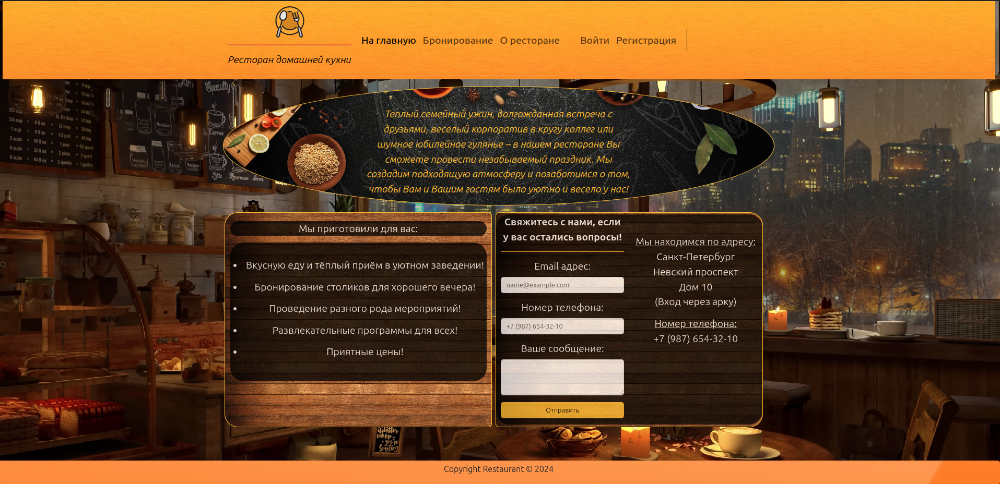

DF2

Сайт для бронирования столиков в ресторане

____________________________
Описание задачи:

    Необходимо создать сайт для бронирования столиков в ресторане.
    Сайт должен быть сверстан и подключен к админке.
    Для выполнения задачи необходимо использовать Django и Bootstrap.
    Сайт должен содержать основные разделы,необходимые для бронирования столиков
    и управления бронированиями.
____________________________
Задача:

    - Сверстать сайт для бронирования столиков.
    - Подключить сайт к админке Django.
    - Использовать Bootstrap для создания адаптивного и привлекательного интерфейса.
____________________________

Функционал сайта:

    Главная страница:

        Описание ресторана.

        Перечень предоставляемых услуг.

        Контактная информация.

        Форма для обратной связи.

    Страница "О ресторане":

        История ресторана.

        Миссия и ценности.

        Команда.

    Страница бронирования:

        Форма для бронирования столика.

        Просмотр доступности столиков.

        Подтверждение бронирования.

    Личный кабинет:

        Регистрация и авторизация пользователей.

        Просмотр истории бронирований.

        Управление текущими бронированиями (изменение, отмена).

    Админка:

        Управление пользователями.

        Управление бронированиями.

        Управление контентом сайта (тексты, изображения и т.д.).

____________________________

Технические требования:

    Фреймворк:

        Использовать фреймворк Django для реализации проекта.

    База данных:

        Использовать PostgreSQL для хранения данных.

    Фронтенд:

        Использовать Bootstrap для создания адаптивного интерфейса.

    Контейнеризация:

        Использовать Docker и Docker Compose для контейнеризации приложения.

    Документация:

        В корне проекта должен быть файл README.md с описанием структуры проекта 
        и инструкциями по установке и запуску.

    Качество кода:

        Соблюдать стандарты PEP8.

____________________________

    Весь код должен храниться в удаленном Git репозитории.