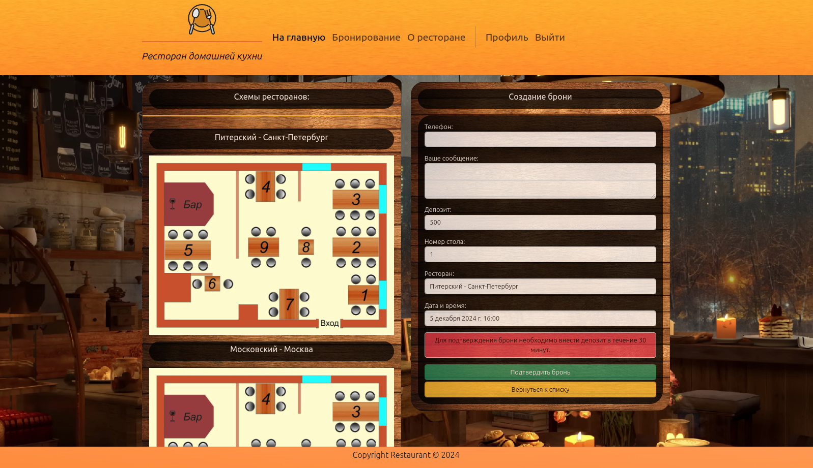

# Сайт для бронирования столиков в ресторане (DF2)
<hr>

## Разделы проекта:

### [Описание проекта](#описание-проекта)

### [Структура](#структура)

### [Предустановки](#предустановки)

### [Команды](#команды)

### [Скриншоты страниц сайта](#вид-страниц-сайта)

<hr>

## Описание проекта

### В современном мире становится всё меньше времени, чтобы его сэкономить - мы сделали сайт ресторана, где можно забронировать столик к нужному времени, чтобы Вам было удобно посещать наш ресторан без ожидания свободного столика. А история ваших бронирований и их статусы будут отражены в вашем личном кабинете.
### А так же вы можете ознакомиться с рестораном, его персоналом, историей или связаться с нами через форму обратной связи или по телефону, мы обязательно ответим на все ваши вопросы!

<hr>

## Структура

```bash
.
├── config
│   ├── asgi.py
│   ├── celery.py
│   ├── settings.py
│   ├── urls.py
│   └── wsgi.py
├── docker-compose.yaml
├── Dockerfile
├── example.env
├── fixtures
│   └── restaurant.json
├── manage.py
├── media
│   ├── bg
│   ├── non_avatar.png
│   ├── restaurant
│   ├── staff
│   └── users
├── README.md
├── requirements.txt
├── reservations
│   ├── admin.py
│   ├── apps.py
│   ├── forms.py
│   ├── management
│   │   └── commands
│   │       ├── check_confirm.py
│   │       ├── check_payment.py
│   │       ├── create_tables.py
│   │       └── update_tables.py
│   ├── migrations
│   ├── models.py
│   ├── services.py
│   ├── signals.py
│   ├── tasks.py
│   ├── templates
│   │   └── reservations
│   │       ├── list_reservation__for_profile.html
│   │       ├── reservation_confirm_delete.html
│   │       ├── reservation_form.html
│   │       └── reservation_list.html
│   ├── tests.py
│   ├── urls.py
│   ├── validators.py
│   └── views.py
├── restaurant
│   ├── admin.py
│   ├── apps.py
│   ├── forms.py
│   └── management
│       └── commands
│           └── fill.py
│   ├── migrations
│   ├── models.py
│   ├── templates
│   │   └── restaurant
│   │       ├── about.html
│   │       ├── base.html
│   │       ├── feedback.html
│   │       ├── includes
│   │       │   └── inc_menu.html
│   │       └── index.html
│   ├── tests.py
│   ├── urls.py
│   └── views.py
├── setup.cfg
├── static
│   ├── css
│   ├── img
│   ├── js
│   └── readme
└── users
    ├── admin.py
    ├── apps.py
    ├── forms.py
    ├── management
    │   └── commands
    │       └── csu.py
    ├── migrations
    ├── models.py
    ├── templates
    │   └── users
    │       ├── email_confirmation_sent.html
    │       ├── login.html
    │       ├── reg_confirm.html
    │       ├── register.html
    │       ├── user_confirm_delete.html
    │       ├── user_detail.html
    │       ├── user_form.html
    │       ├── user_password_reset.html
    │       └── user_password_sent.html
    ├── tests.py
    ├── urls.py
    └── views.py
```

<hr>

## Предустановки

    Перед запуском необходимо:
        1) Установить docker следуя инструкции на сайте для своей ОС: https://www.docker.com/
        2) .env.example переименовать в .env
        3) Заполнить .env
        4) Запустить командой: "docker-compose up -d --build"
        5) Если .env заполнен верно - создадутся 5 объединённых контейнеров.
        6) Сервер доступен по адресу: http://0.0.0.0:8000/

<hr>

## Команды
    ____________________________________________________________________
    Запуск через docker-compose: "docker-compose up -d --build"
    ____________________________________________________________________
    Запуск без docker-compose: "python manage.py runserver 0.0.0.0:8000"
    ____________________________________________________________________
    Наполнение контентом из фикстур: "python manage.py fill"
    ____________________________________________________________________
    Создание администратора: "python manage.py csu"
    (email = admin@pow.ru , password = 12345)
    ____________________________________________________________________
    Создание доступных столов: "python manage.py create_tables"
    ____________________________________________________________________

<hr>


## Вид страниц сайта:
### Главная:


### О ресторане:


### Профиль пользователя:


### Профиль пользователя:


### Профиль пользователя:

